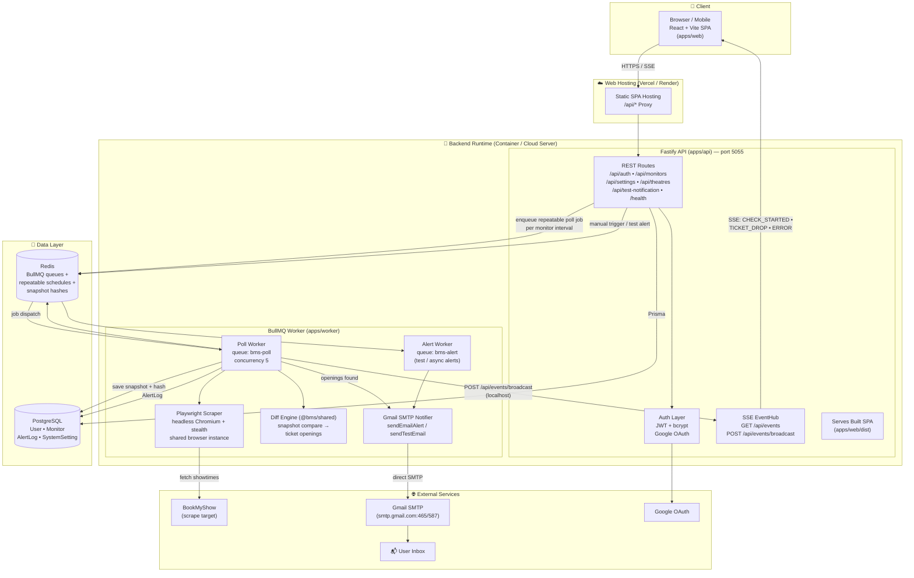
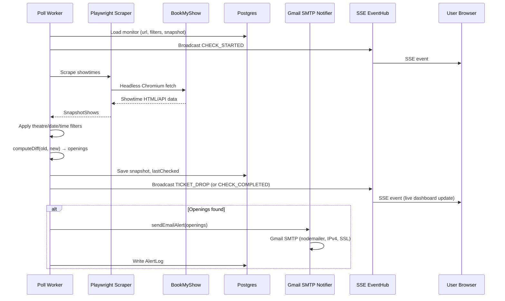

# BookMyShow Ticket Monitor — System Architecture & Data Flow

This document details the actual runtime architecture, data flow, background queue scheduling, and Gmail SMTP notification pipeline for the BookMyShow Ticket Monitor.

---

## 1. System Architecture Diagram

---

## 2. Real-Time Ticket Drop Runtime Flow

---

## 3. Core Component Overview

1. **Monorepo Structure:**
   - `apps/api`: Fastify backend handling REST endpoints, device vault sessions, and SSE broadcasting.
   - `apps/worker`: BullMQ queue worker and Playwright scraping engine.
   - `apps/web`: React + Vite mobile-responsive web application.
   - `packages/db`: Prisma PostgreSQL client and migration schemas.
   - `packages/shared`: State diff engine, type definitions, and show status classifiers.

2. **Single Purpose Notification Pipeline:**
   - All alerts are sent directly through **Gmail SMTP** (`nodemailer`) using standard 16-character Google App Passwords.
   - Eliminates 3rd-party vendor rate-limits and fallback failures.

3. **Direct Database Inspectability:**
   - PostgreSQL is directly accessible with any standard database client (VS Code Database extensions, TablePlus, DBeaver, or psql) using `DATABASE_URL`.
